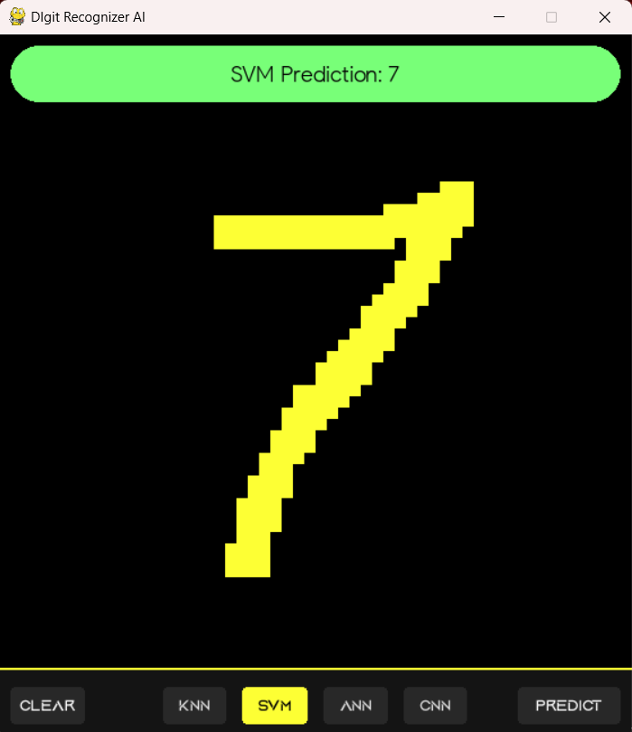

# DIgit Recognizer AI

#### A hand written digit recognizer implementing Convolutional Neural Network (CNN), Artificial Neural Network (ANN), K-Nearest Neighbors (KNN) and Support Vector Machine (SVM) algorithms

###### See also 
[Natural Language Processing](https://github.com/ChauhanRohan-RC/NLP.git)
[Optical Character Recognizer](https://github.com/ChauhanRohan-RC/OCR-AI.git)
[Online Multiplayer Ping-Pong AI](https://github.com/ChauhanRohan-RC/Ping-Pong-AI.git)
[3D NxNxN Rubik's Cube Simulation and Solver](https://github.com/ChauhanRohan-RC/Cube.git)  

####

####

### Overview

Contains four AI models listed below
* _**Artificial Neural Network (ANN)**_
  * Input Layer (784 neurons)
  * Dense 1 (128 neurons)
  * Dense 2 (32 neurons)
  * Output Layer (10 neurons)
  * Tested Accuracy: 98.2 %
* _**Convolutional Neural Network (DNN)**_: 
  * Convolutional Layer (12 kernels of size 3x3) for feature detection
  * Output of this layer is fed to ANN
  * Tested Accuracy: 99.4 %
* **_K-Nearest Neighbour (KNN) Classifier_** 
  * k: 3-7
  * Tested Accuracy: 96.7 %
* **_Support vector Machine (SVM) Classifier_**
  * kernel: rbf, poly
  * C = 2.0
  * Tested Accuracy: 98.1 %

All the models are trained on [MNIST digits dataset](https://www.tensorflow.org/datasets/catalog/mnist) containing 60,000 samples of 28x28 images.

####

####

### Usage
* Clone repository `git clone https://github.com/ChauhanRohan-RC/DigitRecognizer-AI.git`
* `python main.py`

### Controls
* Mouse L-Click Drag:  Draw
* Mouse R-CLick Drag :  Erase
* Enter/Space :  Recognize drawn digit
* Escape :  Clear canvas / Quit
* S : Toggle Sound

####

####

## Connect on
[Twitter](https://twitter.com/0rc_studio)  
[Youtube](https://www.youtube.com/channel/UCmyvutGWtyBRva_jrZfyORA)  
[Google Play Store](https://play.google.com/store/apps/dev?id=7315303590538030232)  
E-mail: com.production.rc@gmail.com
